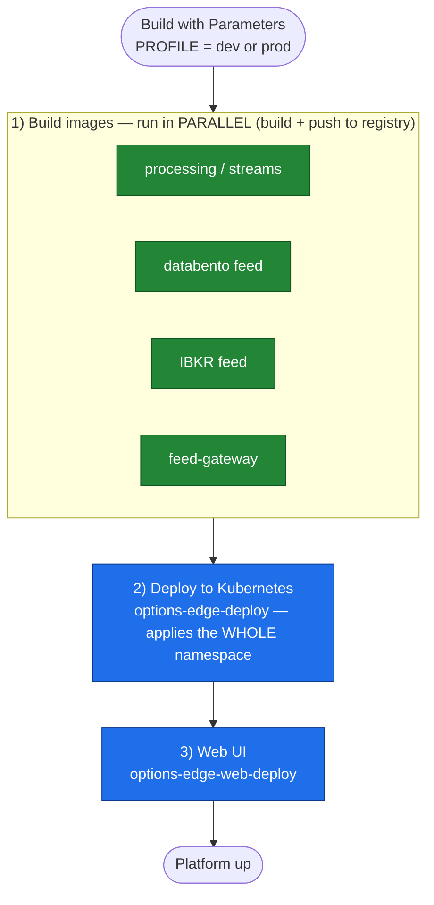

# OptionsEdge — Bring-Up-All Pipeline

> **Status: DRAFT.** Not enable-ready yet. See [Prerequisites](#prerequisites-before-enabling).

A single Jenkins pipeline (`Jenkinsfile.bring-up-all`, job **`options-edge-bring-up-all`**)
that deploys the **entire platform** for a chosen environment (**dev** or **prod**) by
triggering each component's existing Jenkins job in dependency order — sequential where
there is a dependency, parallel where the jobs are independent.

You run **one** job; it orchestrates the rest with the native `build job:` step
(`wait: true` so it blocks on each child, `propagate` so a failure stops the bring-up).

---

## Flow

> **Prerequisite (one-time, not a stage):** Keycloak + Postgres run as standalone Docker
> containers (`oe-keycloak-dev`, `oe-keycloak-postgres`) and stay up across deploys. They are a
> one-time setup — the umbrella does **not** manage them and assumes they're already running.

**Order & why** (Keycloak/Postgres are a one-time prerequisite, above — not part of the pipeline)

| Stage | Job(s) | Mode | Notes |
|---|---|---|---|
| 1. Build images | `options-edge-processing`, `databento-feed-deploy` (build-only), `ibkr-feed`, `feed-gateway` | **parallel** | Build + push every service image; no k8s changes here |
| 2. Deploy to Kubernetes | `options-edge-deploy` | sequential | **One** `kubectl kustomize \| apply` deploys the entire `options-edge` namespace (feeds + all stream apps) |
| 3. Web UI | `options-edge-web-deploy` | sequential | Docker container (not in k8s) |

> `hpsf-historical-replay` is intentionally **not** part of this bring-up — run it on its own when needed.

Build is the only parallel stage; it finishes when the **slowest** image build completes. The single
Deploy step is why per-feed deploy stages were dropped — `options-edge-deploy` already applies them all.

---

## Umbrella job parameters

| Parameter | Type | Default | Effect |
|---|---|---|---|
| `PROFILE` | choice `dev` \| `prod` | `dev` | Environment; **passed to every child job**. |
| `FEEDS` | boolean | `true` | Include the Databento/IBKR market feeds. |
| `WEB_UI` | boolean | `true` | Include `options-edge-web-deploy`. |
| `SKIP_KAFKA_TOPICS` | boolean | `false` | Pass through to `options-edge-deploy` to skip Kafka topic reconciliation during code/image-only redeploys. |
| `CONTINUE_ON_FAILURE` | boolean | `false` | `false` = abort the bring-up on the first failed child; `true` = keep going and report failures at the end. |

Run it: **Jenkins → `options-edge-bring-up-all` → Build with Parameters → pick `PROFILE` → Build.**

---

## Image architecture — local Mac (arm64) vs remote Linux (amd64)

The Jenkins build agent is the **Mac (Apple Silicon, `arm64`)**, but the **remote cluster
(A/B) is `amd64`** (CentOS x86_64). An arm64 image deployed to the amd64 remotes fails at
runtime with **`exec format error`**. So the image platform must follow the deploy target —
the umbrella derives `BUILD_PLATFORM` from `PROFILE` and passes it to every child:

| `PROFILE` | Deploy target | `BUILD_PLATFORM` | Image registry |
|---|---|---|---|
| `dev` | local Mac docker-desktop (arm64) | `linux/arm64` (native, fast) | local docker-desktop |
| `prod` | remote Linux k3s on A/B (amd64) | `linux/amd64` (buildx cross-build on the Mac) | A's registry `192.168.100.252:5000` |

Each child **build** job must honor it via `docker buildx build --platform "$BUILD_PLATFORM"`.

- **Reference implementation:** `option-edge-feed-gateway` already does this — a `BUILD_PLATFORM`
  param (default `linux/arm64`, prod forces `linux/amd64`) built with buildx.
- **Gap to close:** `options-edge-processing` and `options-edge-databento-feed` currently use a
  plain `docker build` (native arm64) — they must adopt the same buildx pattern before a `prod`
  bring-up produces runnable images.

---

## How dev vs prod differ

The umbrella only **forwards** `PROFILE`. The actual difference lives in each child job,
which reads `PROFILE` and selects its environment config. Below is the web UI
(`options-edge-web-deploy`) — **dev values are current/known; prod values must be defined
per the production environment** (the app intentionally has *no* prod defaults — see
`RuntimeProfileConfig`, where prod falls back to empty and every value must be supplied).

| Env var | `dev` | `prod` |
|---|---|---|
| `APP_PROFILE` | `dev` | `prod` |
| `APP_MARKET_DATA_SOURCE` | `DATABENTO` | `DATABENTO` |
| `VITE_API_BASE_URL` | `http://localhost:8090` | `https://bleadingoptions.com` |
| `VITE_WS_URL` | `ws://192.168.100.102:8093/ws/events` | `wss://bleadingoptions.com/ws/events` |
| `VITE_MISSION_CONTROL_URL` | `http://localhost:8090` | `https://bleadingoptions.com` |
| `KAFKA_BOOTSTRAP_SERVERS` | _dev default_ | `192.168.100.252:9092,192.168.100.4:9092` — **confirm** |
| `VITE_AUTH_ENABLED` | `true` | `true` (auth mandatory in every env) |
| `VITE_AUTH_ISSUER` | `http://192.168.100.102:8089/realms/optionsedge` | `https://auth.bleadingoptions.com/realms/optionsedge` (deployed 2026-08-08) |
| `VITE_AUTH_CLIENT_ID` | `options-edge-web` | `options-edge-web` |
| `AUTH_AUDIENCE` / `VITE_AUTH_AUDIENCE` | `options-edge-web` | `options-edge-web` |

The k8s-deployed jobs (`options-edge-deploy`, feeds, gateway, replay) likewise read
`PROFILE` to choose their target — **define what prod means for them** (namespace /
configmap / Kafka bootstrap) when wiring up their `PROFILE` parameter.

---

## Prerequisites (before enabling)

This pipeline is a scaffold. A few things must be finished first.
> Jenkins is the **local `docker-desktop` pod `jenkins-0`** (up at `localhost:8085`) — **not**
> a service on Machine A — so this work does **not** depend on the remote boxes being powered on.

1. **Confirm child job names.** From the live controller, confirmed jobs:
   `options-edge-web-deploy`, `option-edge-feed-gateway`, `options-edge-databento-feed-deploy`,
   `options-edge-ibkr-feed`. Still to decide: **processing** (`options-edge-deploy` vs
   `options-edge-processing`) and **replay** (`hpsf-historical-replay`?). Replace the
   `// TO-VERIFY` placeholders accordingly.
2. **Auth + DB has no job.** Keycloak + Postgres run as Docker containers (`oe-keycloak-dev`,
   `oe-keycloak-postgres`), not a Jenkins job — so the "Auth + DB" stage needs a small wrapper
   job (`docker start …` / `compose up`) or an inline docker step. *(Decision pending.)*
3. **Parameterize each child for dev/prod** — declare a `PROFILE` param and branch its env on it
   (today `options-edge-web-deploy` hardcodes `APP_PROFILE=dev`).
4. **Build the right arch per `BUILD_PLATFORM`** — each child *build* job must use
   `docker buildx build --platform "$BUILD_PLATFORM"`. `option-edge-feed-gateway` already does;
   `options-edge-processing` and `options-edge-databento-feed` still use plain `docker build`
   (native arm64) and will produce images that fail on the amd64 remotes.

Until these are done, a run fails at the first stage (no such job / no such parameter / wrong-arch image).

---

## Failure behavior

- **`CONTINUE_ON_FAILURE = false` (default):** the first failing child fails its stage and
  the whole run stops there (`propagate: true`). Fix that one job, re-run.
- **`CONTINUE_ON_FAILURE = true`:** the run continues past failures and reports which
  stages failed at the end.

Every `build job:` call prints a link to the downstream build in the console, so you can
drill into any single component's own log from the umbrella run.
