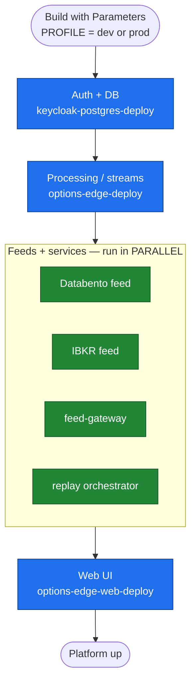

# OptionsEdge — Bring-Up-All Pipeline

> **Status: DRAFT.** Not enable-ready yet. See [Prerequisites](#prerequisites-before-enabling).

A single Jenkins pipeline (`Jenkinsfile.bring-up-all`, job **`options-edge-bring-up-all`**)
that deploys the **entire platform** for a chosen environment (**dev** or **prod**) by
triggering each component's existing Jenkins job in dependency order — sequential where
there is a dependency, parallel where the jobs are independent.

You run **one** job; it orchestrates the rest with the native `build job:` step
(`wait: true` so it blocks on each child, `propagate` so a failure stops the bring-up).

---

## Flow

**Order & why**

| Stage | Job(s) | Mode | Depends on |
|---|---|---|---|
| 1. Auth + DB | `keycloak-postgres-deploy` | sequential | — (must be first) |
| 2. Processing / streams | `options-edge-deploy` | sequential | Kafka up |
| 3. Feeds + services | `databento-feed`, `ibkr-feed`, `feed-gateway`, `replay-orchestrator` | **parallel** | Kafka + processing |
| 4. Web UI | `options-edge-web-deploy` | sequential | auth + backend |

The parallel stage finishes when the **slowest** of its four jobs completes (not the sum).

---

## Umbrella job parameters

| Parameter | Type | Default | Effect |
|---|---|---|---|
| `PROFILE` | choice `dev` \| `prod` | `dev` | Environment; **passed to every child job**. |
| `FEEDS` | boolean | `true` | Include the Databento/IBKR market feeds. |
| `WEB_UI` | boolean | `true` | Include `options-edge-web-deploy`. |
| `CONTINUE_ON_FAILURE` | boolean | `false` | `false` = abort the bring-up on the first failed child; `true` = keep going and report failures at the end. |

Run it: **Jenkins → `options-edge-bring-up-all` → Build with Parameters → pick `PROFILE` → Build.**

---

## How dev vs prod differ

The umbrella only **forwards** `PROFILE`. The actual difference lives in each child job,
which reads `PROFILE` and selects its environment config. Below is the web UI
(`options-edge-web-deploy`) — **dev values are current/known; prod values must be defined
per the production environment** (the app intentionally has *no* prod defaults — see
`RuntimeProfileConfig`, where prod falls back to empty and every value must be supplied).

| Env var | `dev` | `prod` |
|---|---|---|
| `APP_PROFILE` | `dev` | `prod` |
| `APP_MARKET_DATA_SOURCE` | `DATABENTO` | `DATABENTO` |
| `VITE_API_BASE_URL` | `http://localhost:8090` | _prod URL_ (e.g. `https://optionsedge.internal`) — **TBD** |
| `VITE_WS_URL` | `ws://192.168.100.252:30097/ws/events` | _prod WS URL_ — **TBD** |
| `VITE_MISSION_CONTROL_URL` | `http://localhost:8090` | _prod URL_ — **TBD** |
| `KAFKA_BOOTSTRAP_SERVERS` | _dev default_ | `192.168.100.252:9092,192.168.100.4:9092` — **confirm** |
| `VITE_AUTH_ENABLED` | `true` | `true` (auth mandatory in every env) |
| `VITE_AUTH_ISSUER` | `http://192.168.100.102:8089/realms/optionsedge` | _prod Keycloak issuer_ — **TBD** |
| `VITE_AUTH_CLIENT_ID` | `options-edge-web` | `options-edge-web` |
| `AUTH_AUDIENCE` / `VITE_AUTH_AUDIENCE` | `options-edge-web` | `options-edge-web` |

The k8s-deployed jobs (`options-edge-deploy`, feeds, gateway, replay) likewise read
`PROFILE` to choose their target — **define what prod means for them** (namespace /
configmap / Kafka bootstrap) when wiring up their `PROFILE` parameter.

---

## Prerequisites (before enabling)

This pipeline is a scaffold. Two things must be done first — both require the Jenkins
controller (Machine A), so they are deferred until it is online:

1. **Verify child job names.** Every name marked `// TO-VERIFY` in `Jenkinsfile.bring-up-all`
   is a placeholder. Only `options-edge-web-deploy` is confirmed. Replace the rest with the
   real job names from the controller.
2. **Parameterize each child for dev/prod.** The `PROFILE` pass-through only takes effect
   once each child job declares a `PROFILE` string parameter and branches its env on it.
   Today they don't (e.g. `options-edge-web-deploy` hardcodes `APP_PROFILE=dev`).

Until both are done, a run fails at the first stage (no such job / no such parameter).

---

## Failure behavior

- **`CONTINUE_ON_FAILURE = false` (default):** the first failing child fails its stage and
  the whole run stops there (`propagate: true`). Fix that one job, re-run.
- **`CONTINUE_ON_FAILURE = true`:** the run continues past failures and reports which
  stages failed at the end.

Every `build job:` call prints a link to the downstream build in the console, so you can
drill into any single component's own log from the umbrella run.
